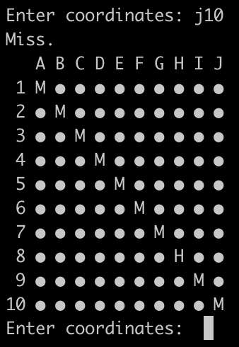

# BATTLESHIPS

## A terminal based single player battleships game written in js.



### Set up

To run the game, execute the following command:

```bash
node main
```

If you run into issues here, try switching to my node version: (20.10.0).

To run the tests:

```bash
npm i && npm run test
```

npm version: 10.2.3

### ADR

I focused heavily on simplicity.
I used vite to initially scaffold the project, but ended up removing all of the boilerplate.

I made the assumption that many variables, and settings that could be dynamically set to extend the functionality, wouldn't need to be changed in the near future, and were catered specifically for the problem.
For example, one could add the capacity to add or remove different ships of different sizes. This would have the effect of needing to have more edge cases, e.g. is the ship too long? how many ships are on the board? And also needing to extend the test functionality in the same way.

I opted for jest for testing mainly as I'm more familiar with it's api than other testing solutions.

Another extension of functionality could be tracking the hits per ship and giving that feedback to the player when they've successully sunk an individual ship.

I opted for individual files for a few reasons:

-   From what I've seen with game and creative development, the prevailing trend is larger individual files.
-   Test files in my opinion are ok being longer as the format is easily parsed per block.

Generally with React I wouldn't want a file over 100 lines, unless it's the first child of a large context provider, or a reducer.

### Considerations

How would one make this a two player game?

-   Allow players to set the position of their ships.
-   Would need two different board representations.

It would be interesting to take this solution and sync it with html to create a functional UI.
How would you map the questions to interactive events?

### Final Remarks

This was a fun challenge. I very much appreciate a unique coding challenge that isn't framework oriented, so thanks for that!

Looking forward to chatting about tech.

Thanks :)
